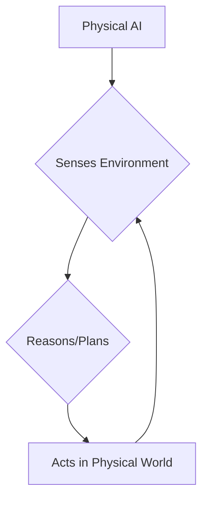

import LearningObjective from '@site/src/components/LearningObjective';
import KeyConcept from '@site/src/components/KeyConcept';
import HardwareSpec from '@site/src/components/HardwareSpec';

# Week 1: Introduction to Physical AI

<LearningObjective>
  Understand the fundamental concepts of Physical AI and its distinction from traditional AI.
</LearningObjective>

## What is Physical AI?

Physical AI refers to intelligent systems that can perceive, reason, and act in the real world. Unlike purely software-based AI (like chatbots or recommendation systems), Physical AI systems are embodied in robots or other physical agents and interact directly with their environment.

This field combines elements of:
*   **Artificial Intelligence**: Machine learning, computer vision, natural language processing.
*   **Robotics**: Kinematics, dynamics, control systems, sensor fusion.
*   **Cognitive Science**: Understanding perception, action, and learning in biological systems.



### From Digital AI to Embodied Intelligence

Traditional AI often operates in simulated or abstract environments. For example, a chess AI plays within a defined digital board, or a language model processes text. While incredibly powerful, these systems lack direct interaction with the messy, unpredictable physical world.

Embodied intelligence, a core aspect of Physical AI, posits that an agent's physical body and its interactions with the environment are crucial for the development of complex cognitive abilities.

<KeyConcept title="Embodied Intelligence">
  The idea that intelligence emerges from the interactions between an agent's body, its brain, and its environment. The physical form and its sensory-motor capabilities heavily influence how an agent perceives and understands the world.
</KeyConcept>

## Humanoid Robotics Landscape Overview

Humanoid robots are a significant area within Physical AI, aiming to create robots that resemble and interact with humans in human-centric environments. Early humanoid robots focused on bipedal locomotion, while modern research extends to manipulation, social interaction, and robust task execution.

Key players and research areas include:
*   **Boston Dynamics**: Known for advanced locomotion and balance (e.g., Atlas).
*   **Agility Robotics**: Developing bipedal robots for logistics (e.g., Digit).
*   **Honda ASIMO**: Pioneering humanoid research (now retired).
*   **Open-source platforms**: Such as `OpenHumanoids` and various research projects.

## Sensor Systems: The Eyes and Ears of Physical AI

Physical AI systems rely heavily on diverse sensor systems to gather information about their environment.

*   **LIDAR (Light Detection and Ranging)**: Uses pulsed laser light to measure distances, creating 2D or 3D maps of the surroundings. Crucial for navigation and obstacle avoidance.
*   **Cameras (Monocular, Stereo, RGB-D)**: Provide visual information.
    *   **Monocular**: Single camera, similar to human eye.
    *   **Stereo**: Two cameras, enabling depth perception (like human eyes).
    *   **RGB-D**: Provides color (RGB) and depth (D) information directly.
*   **IMUs (Inertial Measurement Units)**: Measure orientation, angular velocity, and gravitational forces. Essential for robot balance and motion tracking.
*   **Force/Torque Sensors**: Measure forces and torques applied to robot joints or end-effectors. Critical for precise manipulation, safe human-robot interaction, and tactile feedback.

<HardwareSpec
  name="Typical Mobile Robot Sensor Suite"
  specs={[
    { label: 'LIDAR Range', value: '10-30 meters' },
    { label: 'Camera Resolution', value: '1080p to 4K' },
    { label: 'IMU Axes', value: '6-axis (accelerometer + gyroscope)' },
    { label: 'Force Sensor Range', value: '1-100 Newtons' },
  ]}
/>

These sensors provide the raw data that AI algorithms process to understand the environment, detect objects, navigate, and make decisions.

```python
import numpy as np

def fuse_sensor_data(lidar_data, camera_data, imu_data):
    """
    A simplified example of sensor fusion.
    Combines LIDAR (distance), Camera (object detection confidence), and IMU (orientation).
    """
    # Simulate processing steps
    processed_lidar = np.mean(lidar_data) # Average distance
    processed_camera = np.max(camera_data) # Max object confidence
    processed_imu = imu_data[0] # Roll from IMU

    # Simple weighted fusion
    fused_output = (0.5 * processed_lidar) + (0.4 * processed_camera) + (0.1 * processed_imu)
    return fused_output

# Example usage
dummy_lidar = np.array([5.2, 5.5, 5.1]) # distances in meters
dummy_camera = np.array([0.9, 0.7, 0.95]) # object detection confidence
dummy_imu = np.array([0.1, 0.05, 0.01]) # roll, pitch, yaw

fused = fuse_sensor_data(dummy_lidar, dummy_camera, dummy_imu)
print(f"Fused sensor reading: {fused:.2f}")
```

## Next Steps

In the coming weeks, we will delve deeper into the tools and frameworks that enable the development of Physical AI systems, starting with ROS 2.
